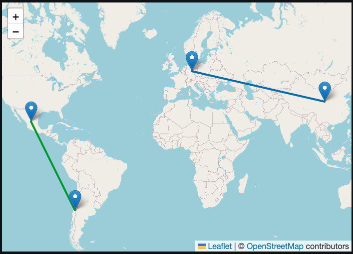

# 🚚 Optimización de Rutas Logísticas con IA

Aplicación desarrollada con **Streamlit** que simula envíos internacionales, predice tiempos de entrega usando **XGBoost**, y selecciona la mejor ruta logística basada en criterios como:

- Tiempo estimado
- Costo logístico
- Riesgo aduanal

> 🎯 Esta app es un MVP funcional enfocado en la eficiencia logística para e-commerce transfronterizo.

---

## 📸 Vista previa



---

## ⚙️ ¿Cómo funciona?

1. **Simulación de envíos**
   - Generación aleatoria de rutas entre países (origen-destino)
   - Variables como clima, transporte, distancia, costo y riesgo

2. **Predicción con Machine Learning**
   - Se usa un modelo XGBoost entrenado con variables como clima, distancia, transporte y retrasos

3. **Selección multi-criterio**
   - El usuario puede ajustar el peso entre **tiempo**, **costo** y **riesgo** para seleccionar la mejor ruta
   - Se muestra una tabla y un mapa con las rutas ganadoras

4. **Visualización**
   - Uso de `folium` para mostrar rutas sobre mapa con colores según el tipo de transporte

---

## 🛠️ Tecnologías utilizadas

- **Python 3.9+**
- [Streamlit](https://streamlit.io/) para frontend interactivo
- [XGBoost](https://xgboost.readthedocs.io/en/latest/) para modelado predictivo
- [Folium](https://python-visualization.github.io/folium/) para mapas
- [Google Sheets](https://docs.google.com/spreadsheets/) para conexión de datos (opcional)
- `joblib`, `pandas`, `numpy` para procesamiento de datos

---

## 🚀 ¿Cómo ejecutar la app localmente?

```bash
git clone https://github.com/tuusuario/optimizacion_rutas.git
cd optimizacion_rutas
python -m venv venv
source venv/bin/activate      # En Mac/Linux
venv\Scripts\activate       # En Windows

pip install -r requirements.txt

streamlit run app.py
```

---

## 🧠 Potenciales mejoras (Fase 2)

- Conexión con API de rutas reales (OpenRouteService, Google Maps)
- Panel histórico de métricas
- Carga de rutas personalizadas vía CSV
- Autenticación de usuarios
- Ajuste dinámico de modelo y simulaciones

---

## 👨‍💻 Autor

Desarrollado por **Asairi Nava**  
Especialista en analítica de datos aplicada a logística, e-commerce y optimización de procesos.

---

## 🌐 Demo en línea

[🔗 Ver la app en Streamlit Cloud](https://share.streamlit.io/user/asairinava/)

